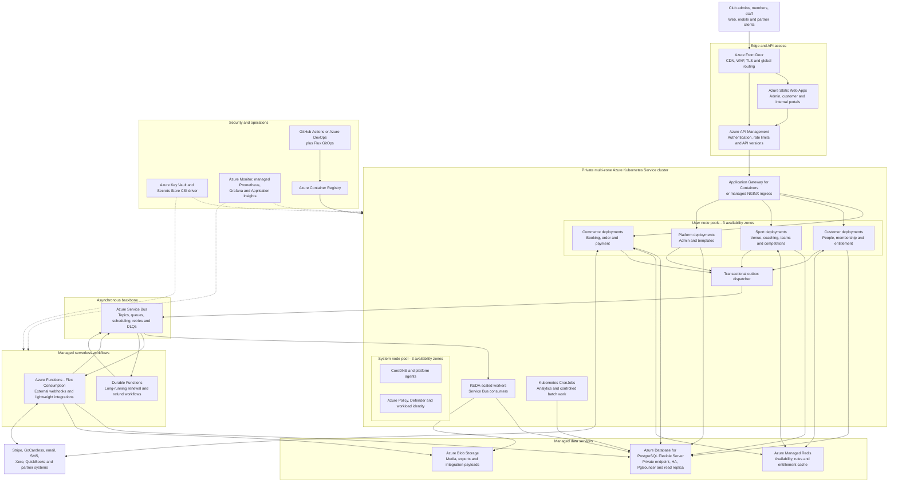

# Azure AKS Reference Architecture

This alternative hosts the synchronous ClubSpark services and selected workers on a private, multi-zone Azure Kubernetes Service cluster. Azure Functions remain available for lightweight integration and orchestration workloads.

## AKS Resilience Baseline

- Use a private Standard-tier AKS cluster with availability-zone-spanning system and user node pools.
- Run at least three replicas of critical APIs with topology spread constraints across zones.
- Apply pod disruption budgets, readiness/startup probes and rolling deployment safeguards.
- Use separate system, general application and compute-heavy batch node pools.
- Enable horizontal pod autoscaling, cluster autoscaling and KEDA for Service Bus consumers.
- Use workload identity and the Key Vault Secrets Store CSI driver instead of Kubernetes secrets for credentials.
- Use Azure CNI powered by Cilium, Network Policies, Defender for Containers and Azure Policy.
- Keep PostgreSQL, Redis, Service Bus and Blob Storage outside the cluster as managed Azure services.
- Deploy a second AKS cluster in another region when regional recovery objectives require it.

The presentation-ready SVG is in [`azure-aks-reference-architecture.svg`](./azure-aks-reference-architecture.svg).
