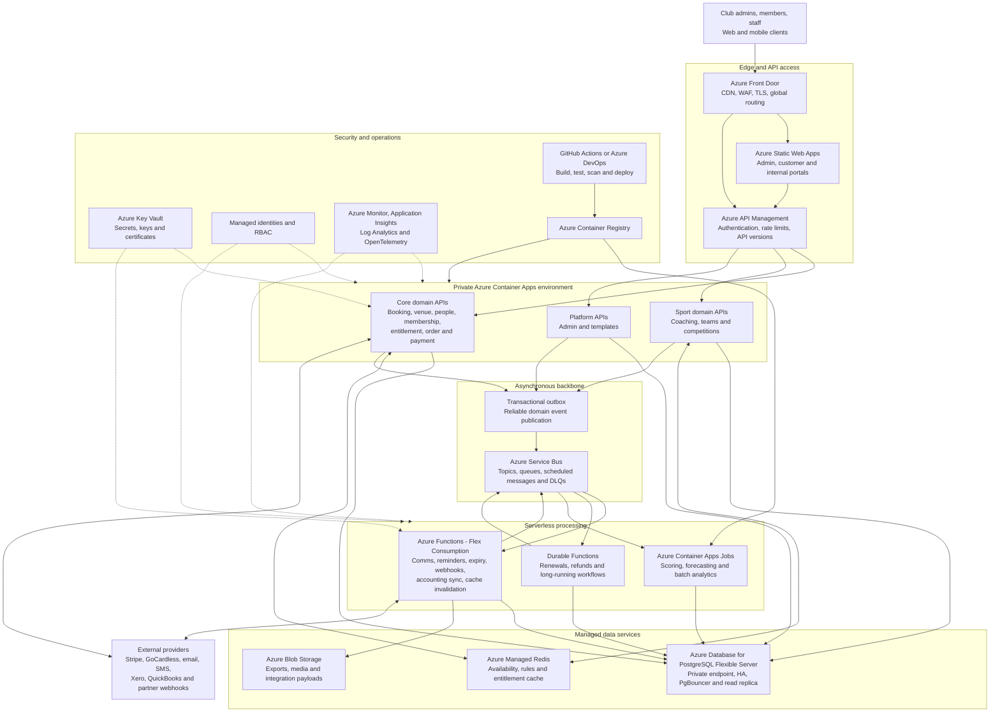

# Azure Reference Architecture

This diagram describes the recommended hybrid serverless deployment for the ClubSpark platform.

## Deployment Principles

- Keep synchronous NestJS domain APIs in Azure Container Apps.
- Use Azure Functions for short, event-driven and scheduled processing.
- Use Container Apps Jobs for heavier analytics and batch workloads.
- Publish domain events through a transactional outbox and Azure Service Bus.
- Keep all application services private behind API Management and Front Door.
- Use managed identities and Key Vault instead of application-held credentials.
- Connect Prisma workloads through PgBouncer and cap per-instance concurrency.

The presentation-ready SVG version is in [`azure-reference-architecture.svg`](./azure-reference-architecture.svg).
