# Current Reference Architecture

> **As implemented in the repository:** 25 August 2026  
> **Scope:** Current pilot codebase, including locally implemented architecture hardening. This is
> not the future Azure deployment diagram. New projection, lease, Order outbox and consumer-inbox
> migrations have not yet been applied to an environment.

```mermaid
flowchart TB
  subgraph channels["User and partner channels"]
    adminPortal["Admin Portal<br/>Next.js"]
    customerPortal["Customer Portal<br/>Next.js, tenant slug"]
    internalPortal["Internal Staff Portal<br/>Next.js"]
    mobile["Mobile App<br/>Expo / React Native"]
    partner["Partner APIs and webhooks"]
  end

  auth["Supabase Auth / JWKS<br/>JWT tenant context"]
  access["Direct HTTPS service access<br/>Shared auth guard; no API gateway today"]

  adminPortal --> access
  customerPortal --> access
  internalPortal --> access
  mobile --> access
  partner --> access
  auth --> access

  subgraph services["Stateless NestJS domain services"]
    direction TB

    subgraph foundation["Platform and foundation"]
      admin["Admin<br/>registry, RBAC, flags"]
      template["Template<br/>site templates"]
      venue["Venue<br/>organisations, facilities,<br/>resources and availability"]
      people["People<br/>contacts, households,<br/>roles, segments and activity"]
    end

    subgraph activity["Participation and sport"]
      booking["Booking<br/>availability, pricing, rules,<br/>series and approvals"]
      coaching["Coaching<br/>coaches, lesson types<br/>and sessions"]
      team["Team<br/>rosters, fixtures,<br/>availability and charges"]
      competition["Competition<br/>entries, draws, matches,<br/>results and rankings"]
      membership["Membership<br/>schemes, plans, status,<br/>renewal and entitlements"]
    end

    subgraph commerce["Commerce and access"]
      entitlement["Entitlement<br/>plans, add-ons and overrides"]
      order["Order<br/>products, orders and line items"]
      payment["Payment<br/>Stripe; GoCardless-ready"]
      commerceGap["Adoption gap<br/>end-to-end purchase orchestration<br/>is not connected yet"]
    end

    subgraph engagement["Engagement, intelligence and connectivity"]
      comms["Comms<br/>notifications, templates,<br/>campaigns and message log"]
      analytics["Analytics<br/>scores, forecasts, anomalies<br/>and player matching"]
      integration["Integration<br/>API keys, partner webhooks,<br/>Xero and QuickBooks"]
    end
  end

  access --> admin
  access --> template
  access --> venue
  access --> people
  access --> booking
  access --> coaching
  access --> team
  access --> competition
  access --> membership
  access --> entitlement
  access --> order
  access --> payment
  access --> comms
  access --> analytics
  access --> integration

  booking -->|"facility hydration APIs"| venue
  booking -->|"people display APIs"| people
  membership -.->|purchase adoption pending| commerceGap
  competition -.->|entry adoption pending| commerceGap
  commerceGap -.-> order
  commerceGap -.-> payment

  subgraph reliability["Durable events and scheduled work — implemented locally"]
    outboxes["Service-owned transactional outboxes<br/>Venue · Coaching · Booking · Membership · Payment · Order"]
    relay["Replica-safe relays<br/>row claims, retry backoff,<br/>dead-letter retention and replay"]
    envelope["Authenticated HTTP fan-out<br/>v1 event envelope: eventId,<br/>correlationId, producer, version"]
    inboxes["Consumer inbox claims<br/>Comms · Integration · People<br/>dedupe by producer + eventId"]
    leases["Scheduled-work coordination<br/>row leases: webhooks and accounting<br/>singleton leases: Membership and Analytics"]
  end

  venue -.->|projection events| outboxes
  coaching -.->|projection events| outboxes
  booking -.->|domain events| outboxes
  membership -.->|domain events| outboxes
  payment -.->|domain events| outboxes
  order -.->|domain events| outboxes
  outboxes --> relay
  relay -.-> envelope
  envelope -.-> inboxes
  inboxes -.-> comms
  inboxes -.-> integration
  inboxes -.-> people
  leases -.->|singleton batch lease| membership
  leases -.->|singleton batch lease| analytics
  leases -.->|row claim, not a lease| comms
  leases -.->|row lease on retry rows| integration

  subgraph bookingReadModel["Booking-owned source projections — code complete, activation pending"]
    venueProjection["Venue projection<br/>resources, units, conflicts,<br/>groups and lighting"]
    coachingProjection["Coaching occupancy projection<br/>unit and time range"]
    rollout["Read modes<br/>legacy → shadow → projection<br/>default remains legacy"]
  end

  venue -.->|snapshot + versioned events| venueProjection
  coaching -.->|snapshot + versioned events| coachingProjection
  venueProjection --> rollout
  coachingProjection --> rollout
  rollout --> booking

  subgraph data["PostgreSQL — shared physical database in the pilot"]
    schemas["Service-owned schemas<br/>one writer per bounded context<br/>tenant-scoped application queries"]
    reporting["Analytics reporting exception<br/>read-only cross-schema aggregation"]
    migrations["Prisma migrations per service<br/>KNOWN_DRIFT is empty"]
  end

  services --> schemas
  analytics -.->|read-only reporting| reporting
  schemas --> migrations
  outboxes --> schemas
  inboxes --> schemas
  leases --> schemas
  venueProjection --> schemas
  coachingProjection --> schemas

  stripe["Stripe<br/>payment provider"]
  accounting["Xero / QuickBooks"]
  downstream["Email, SMS and<br/>partner webhook endpoints"]

  payment <--> stripe
  integration <--> accounting
  comms --> downstream
  integration --> downstream
```

## How to read the diagram

- Solid lines are synchronous calls or database ownership paths. Dotted lines are asynchronous
  event, projection or reporting paths.
- Services are independently deployable bounded contexts and remain the sole writer of their
  schema. The pilot still shares one physical PostgreSQL database.
- Internal HTTP calls use `X-Internal-Secret`; end-user calls use the shared JWT tenant guard.
- Booking's Venue and Coaching projections, durable singleton leases, the Order outbox and consumer
  inboxes are implemented in code but require their additive migrations before activation.
- The Commerce services exist, but Membership and Competition have not yet fully adopted Order as
  the authoritative purchase path.

## Reliability model now present

1. Critical covered state changes commit with an outbox row.
2. Relays use row claiming, retry backoff and retained dead letters.
3. Durable events carry stable v1 envelope identifiers.
4. Comms, Integration and People suppress normal duplicate delivery with inbox claims.
5. Queue-like jobs use row leases; whole-dataset Membership and Analytics jobs use database-time
   singleton leases.

The remaining architecture work is tracked in
[`../roadmap/architecture-hardening-todo.md`](../roadmap/architecture-hardening-todo.md). Target Azure
deployment choices are deliberately separate in
[`azure-reference-architecture.md`](azure-reference-architecture.md) and
[`azure-aks-reference-architecture.md`](azure-aks-reference-architecture.md).
